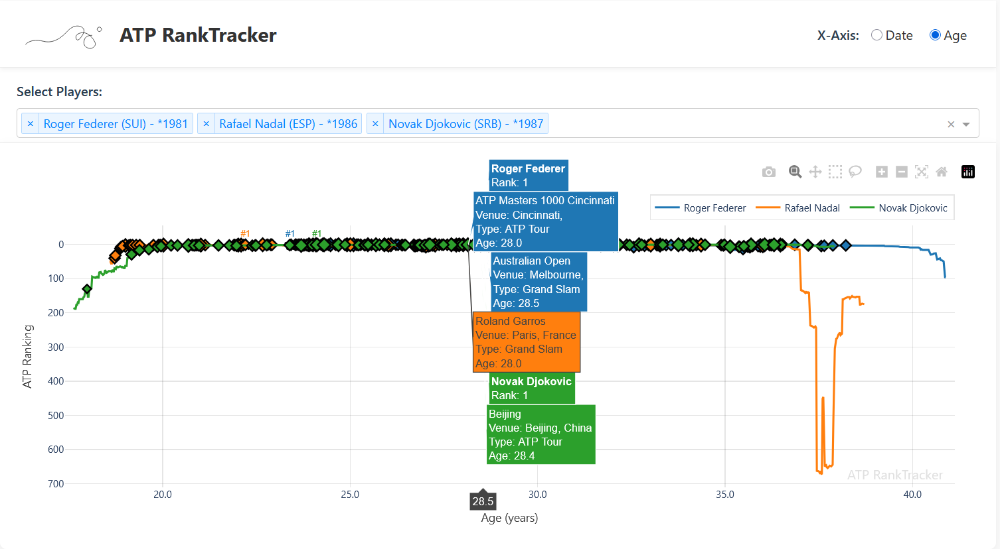

# ATP RankTracker


A web-based interactive dashboard for exploring historical ATP tennis player rankings from the 1970s to the present.  
Built with [Dash](https://dash.plotly.com/) and powered by data directly from the ATP Tour website.

---

## Overview

ATP RankTracker allows tennis fans and analysts to visualize and compare the ranking trajectories of professional tennis players throughout their careers.
The application provides an intuitive interface to track how players' rankings evolved over time or by age, with special markers for tournament victories.

---

## Features

- **Player Selection:** Search and select multiple players with autocomplete (search by name, country, or birth year)
- **Flexible Visualization:** Toggle between ranking by calendar date or player age
- **Tournament Wins:** View markers for tournament victories with detailed information on hover
- **Interactive Controls:** Zoom, pan, and hover for detailed information
- **Responsive Design:** Works on desktop and mobile devices
- **Data Coverage:** Complete ATP rankings history from 1973 to present

---

## Example



*Above: Comparing the ATP ranking trajectories of Roger Federer, Rafael Nadal, and Novak Djokovic by age.*

---

## Quick Start

### 1. Clone the repository

```console
git clone https://github.com/cfgackstatter/atp-rankings.git
cd atp-rankings
```

### 2. Install dependencies

```console
python -m venv venv
source venv/bin/activate # On Windows: venv\Scripts\activate
pip install -r requirements.txt
```

### 3. Scrape data (first time only)

```console
python main.py --scrape-atp
python main.py --scrape-players 100 # Scrape top 100 players
```

### 4. Run the application

```console
python application.py
```

Visit [http://localhost:5000](http://localhost:5000) in your browser.

---

## Technical Details

### Data Pipeline

- **Data Collection:** Custom scrapers for ATP rankings, player details, and tournament results
- **Data Processing:** Efficient preprocessing with pandas for optimal visualization
- **Storage:** Compressed parquet files for fast loading and minimal storage requirements

---

## Tech Stack

- **Frontend:** Dash by Plotly (Python-based web framework)
- **Data Processing:** Pandas, Polars, NumPy
- **Web Scraping:** Requests, BeautifulSoup, Requests-HTML
- **Deployment:** AWS Elastic Beanstalk

---

## Future Roadmap

- Individual player statistics pages
- Head-to-head comparison features
- WTA (women's tennis) rankings integration
- Advanced filtering by tournament types and surfaces

---

## Data Source & License

- **Data:** Scraped from the official ATP Tour website
- **License:** MIT License

---

## Acknowledgements

- [Dash by Plotly](https://dash.plotly.com/)
- [ATP Tour](https://www.atptour.com/) for the ranking data

---

*Enjoy exploring ATP tennis history!*