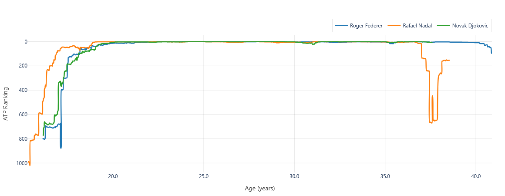

# ATP Rankings Visualization Tool


A web-based interactive dashboard for exploring historical ATP tennis player rankings from the 1970s to the present.  
Built with [Dash](https://dash.plotly.com/) and powered by [Jeff Sackmann's tennis_atp dataset](https://github.com/JeffSackmann/tennis_atp).

---

## Features

- **Search and select multiple players** with autocomplete (search by first or last name, or both)
- **Flexible x-axis:** Toggle between ranking by calendar date or player age
- **Interactive chart:** Zoom, pan, hover for details, and compare player trajectories
- **Clean design:** Responsive layout, modern input fields, and clear legends
- **Open data:** Attribution to Jeff Sackmann's [tennis_atp repository](https://github.com/JeffSackmann/tennis_atp)

---

## Example



*Above: Comparing the ATP ranking trajectories of Roger Federer, Rafael Nadal, and Novak Djokovic by age.*

---

## Quick Start

### 1. Clone the repository

```console
git clone https://github.com/yourusername/atp-rankings.git
cd atp-rankings
```

### 2. Install dependencies

```console
python -m venv venv
source venv/bin/activate # On Windows: venv\Scripts\activate
pip install -r requirements.txt
```

### 3. Run the application

```console
python application.py
```

Visit [http://localhost:8080](http://localhost:8080) in your browser.

---

## Data Source & License

- **Data:** [Jeff Sackmann's tennis_atp repository](https://github.com/JeffSackmann/tennis_atp)
- **License:** Creative Commons Attribution-NonCommercial-ShareAlike 4.0 International License

---

## Acknowledgements

- [Dash by Plotly](https://dash.plotly.com/)
- [Jeff Sackmann's tennis_atp dataset](https://github.com/JeffSackmann/tennis_atp)

---

## Screenshot


---

*Enjoy exploring ATP tennis history!*